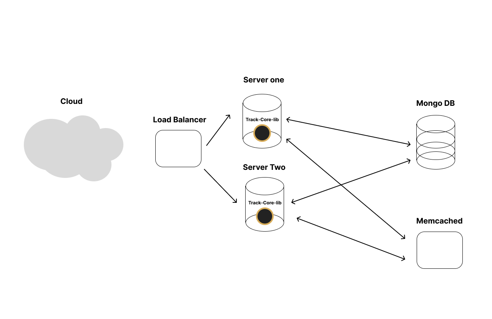

# PayCoreLib
PayCoreLib is built using [Core-Lib](https://github.com/shay-te/core-lib).

## Example

```python
import hydra
from track_core_lib import TrackCoreLib

hydra.core.global_hydra.GlobalHydra.instance().clear()
hydra.initialize(config_path='../../track_core_lib/config')

# Create a new PayCoreLib using hydra (https://hydra.cc/docs/next/advanced/compose_api/) config
track_core_lib = TrackCoreLib(hydra.compose('track_core_lib.yaml'))
```

## License
Core-Lib in licenced under [MIT](https://github.com/shay-te/core-lib/blob/master/LICENSE)


### **Choosing DB**

Because users generate a large volume of data daily, we need a database that can be scaled easily. For this design, I chose **MongoDB**.

### **Calculate Data Volume for Annual Documents**

#### **Estimate Data Size Per Year**

1. **Daily Data Volume:**
   - Food Log Entry: 500 bytes
   - Sleep Log Entry: 300 bytes
   - Exercise Log Entry: 400 bytes
   - Meditation Log Entry: 200 bytes
   - Total Daily Data Volume: 3 KB
2. **Annual Data Volume:**
   - Annual Data Volume: 3 KB/day × 365 days = 1,095 KB (approximately 1.1 MB)

### **Choosing the document size**

Because the calculated document size is 1MB.

And for MongoDB, this size of data is considered efficient in performance. 

We will create a **document** per user per **year**.

### **The document structure**

```json
TYPE_FOOD = 1

{ 
	"userId": "user123", 
  "year": 2024, 
  "entries": [ 
    { "type": TYPE_FOOD, "date": "2024-01-01T00:00:00Z", "meta_data": { "food":"Breakfast", "calories": 500 } }, 
    ... 
  ] 
}
```


### **Code Example**


In the example code in the link. There is a small library the implement the solution.

The soution was written with Core-Lib [https://github.com/shay-te/core-lib] an in house library we are using here. 


This library knows how to 

- register new tracking 
- store them yearly 
- search by user id and type 


https://github.com/shay-te/track-core-lib


### **API List**


**GET /api/track/<track_id: ind>**
Return track information by id


**GET /api/track/all/user/<user_id:int>**?type=?
Get all track information for this user, optional paramater the type of the track


**POST /api/track/register**
Register new track information 


### **Diagram**




